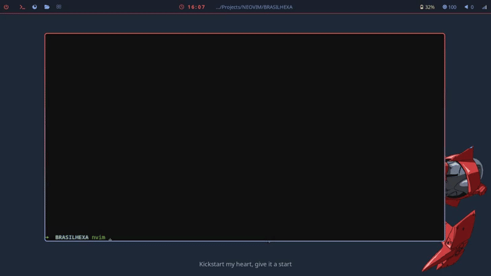

# Mason Catalog



Mason Catalog manages package installation (LSPs, formatters, DAPs, linters, and runtimes) within the Mason ecosystem, while also handling LSP configuration.

## Features

- Automatic LSP enablement by filetype
- Group-based LSP configuration
- Seamless integration with Mason
- Integrations with other plugins, for now: `ensure_conform_formatters`

## Installation

### lazy.nvim

```lua
{
	"ShiMigui/mason-catalog.nvim",
	dependencies = {
		"neovim/nvim-lspconfig",
		{ "mfussenegger/nvim-jdtls", ft = "java" },
		{ "williamboman/mason.nvim", config = true },
	}
}
```

## Configuration
```lua
require("mason-catalog").setup({
    silent = true,
    integrations = { "ensure_conform_formatters" },
    ensure_installed = { "java-debug-adapter", "java-test", "pgformatter" },
    lsp = {
        default_config = require("settings").lsp,
        extensions = {
            { "js", "ts", "jsx", "tsx", lsp = { "typescript-language-server", "eslint-lsp" } },
            { "json", "jsonc", lsp = "json-lsp" },
            { "md", lsp = "marksman" },
        },
        filetypes = {
            { "lua", lsp = "lua-language-server" },
            { "php", lsp = { "intelephense", "phpactor" } },
        },
    },
})
```

---

This plugin is not affiliated with mason.nvim.
